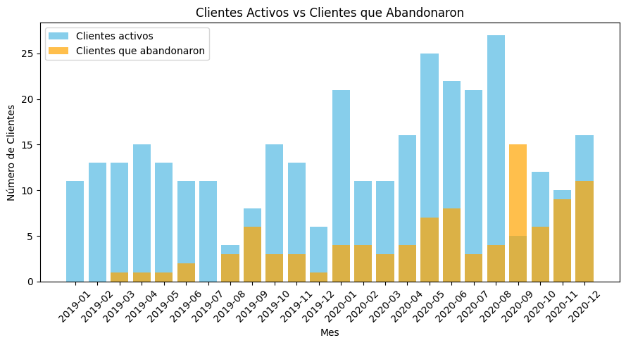

# API_RetencionTECH
Análisis de forma automatizada y disponible para consultar mediante la web de Startup tecnológica, midiendo la tasa de retención y abandono de nuestro producto/servicio (retención de clientes) a través del tiempo para poder observar si se cumple con un PMF (Product Market Fit)

Se determinará el destino de una ronda de inversion, midiendo a traves del tiempo la retención/abandono de clientes de una Startup de tipo Software as a Service (SaaS) que ofrece un servicio de suscripción mensual en la nube, cuyo producto de venta es un software de gestión de gastos. Mediante la ayuda de una API elaborada en Python que permite obtener la colsulta automática de algunas metricas relevantes para determinar si nuestro producto cumple con un PMF (Product Market Fit), es decir, para saber si nuestro producto satisface las nececidades de nuestros clientes/mercado, se compara la tasa de ***RETENCIÓN *** de clientes o ***ABANDONO *** del servicio, cuando la tasa de retención es alta índica que tenemos un buen PMF y en sentido contrario si la tasa de abando es alta, es muy probable que se deba mejorar/optimizar nuestro producto/servicio, por lo tanto, esta API nos ayuda a mantener actualizada nuestra base de datos y que así puedan ser consultados estos indicadores en la nube y sean de facíl comprensión en la toma de decisiones.

### Objetivo: 

Decidir si la inversión recibida será usada en “mejorar el producto” o usada para “expandirse consiguiendo más clientes”. Para lograr el objetivo tenemos que analizar si el producto que se ofrece ha alcanzado el Product-Market Fit por medio de un análisis de retención a través del tiempo (cohort).

> [!Note]
> Un cohort es un grupo de personas que comparten características en común durante un periodo específico (por ejemplo, usuarios que visitaron tu sitio web por primera vez, quienes descargaron una aplicación, etc). Una clasificación típica y la que utilizarás en este proyecto es agrupar a usuarios por fecha de registro o fecha en la que usaron por primera vez tu producto. Esto es útil porque luego puedes medir la retención como el porcentaje de usuarios de cada grupo que sigue usando tu producto en el tiempo (por ejemplo, al cabo de 90 días).

### ¿Que nos facilita a responder esta API para la toma de decisiones?

+ ¿Cuántos de tus clientes siguen consumiendo tu producto después de un mes? +¿Después de 3 mese?, etc.
+ Si realizas un cambio en tu producto, ¿Cómo se comportan tus usuarios con el nuevo cambio este mes en comparación con el anterior?
+ ¿Tus usuarios responden mejor a la misma oferta en una promoción semanal frente a una mensual?
+ Si lanzas un nuevo producto, con este tipo de análisis podrías responder ¿Están los usuarios dispuestos a pagar por el nuevo producto?
+ Porcentaje de retención de clientes por mes
+ Porcentaje de retención de clientes por trimestre, semestre, etc.
+ Porcentaje de abandono de cliente por mes
+ Porcentaje de abandono de cliente por trimestre
+ El mes o trimestre donde perdieron más clientes
  

## 1.-  Ingesta de datos y Transformaciones

Nuestro Dataset contiene las columnas siguientes:

* Cliente: Nombre del cliente

* Estado del Cliente: Puede ser “Active” (sigue pagando la suscripción) o “Churned” (no sigue pagando)

* Mes de Registro: Mes en que inició a pagar la suscripción mensual

* Mes de Abandono: Mes en que dejó de pagar la suscripción mensual

* 24 columnas, una por cada mes del año (Del 1/2019 al 12/2020) en donde se muestra si el cliente pagó (con un 1) o no (con una celda vacía)

### 1.1) Extracion de datos
 Los datos se extrageron del data set de Kaggle --> Retención Startup Tecnológica

 https://www.kaggle.com/datasets/datacertlaboratoria/proyecto-2-startup-tecnolgica

> [!Tip]
> Tambien es posible relizar un proceso automático con la ayuda de python para la desacarga de los archivos csv mediante **web scraping**, y así mantener actualizada nuestra base de datos, mediante la lógica siguiente.

```  python
import requests

def get_client_data():
    # URL de la API de la startup de SaaS que proporciona datos de clientes
    api_url = 'https://api.saasstartup.com/clients'

    try:
        # Realizar una solicitud GET a la API para obtener los datos de los clientes
        response = requests.get(api_url)

        # Verificar si la solicitud fue exitosa (código de estado 200)
        if response.status_code == 200:
            # Convertir la respuesta JSON en un diccionario de Python
            client_data = response.json()

            # Iterar sobre los datos de los clientes y hacer algo con ellos
            for client in client_data:
                # Aquí puedes realizar las operaciones de scraping que desees
                # Por ejemplo, imprimir el nombre y el correo electrónico de cada cliente
                # O en su defecto, extraer ciertas columnas (En formato JSON) de interés 
                print("Nombre:", client['name'])
                print("Correo electrónico:", client['email'])
                print("--------------------")


        else:
            print("Error al obtener los datos de la API:", response.status_code)

    except Exception as e:
        print("Error al conectarse a la API:", str(e))

# Llamar a la función para obtener los datos de los clientes
get_client_data()

```

## 2.- Feature Engineering

En el dataset realizamos consultas de un pequeño análisis de datos, para poder completar el proceso de ETL, concluyendo este último con un Deploy de nuestra API, es decir, aplicamos los procesos de ***Extracción*** (carga de datos) y ***Transformación*** (Limpieza, Transformación, pequeño Análisis y Consulta) de los datos.

* El set de los datos se encuentra limpio, es decir,  no hay datos anormales (***Outliers***)
* Cambiamos nuestras variables categoricas: Object -->  category.

  Vamos a relizar una categorizacion de los datos de los clientes que pagan su renta mensual y los que no, para que se pueda realizar un mejor analisis con Pandas.

```  python
data['Estado Cliente']= data['Estado Cliente'].astype('category')

```
* Conversión  de Object --> Data time.

```  python
# Convertimos la columna 'Mes de Abandono (Churn)' y 'Mes Registro' en un formato de fecha
data['Mes de Abandono (Churn)'] = pd.to_datetime(data['Mes de Abandono (Churn)'])
data['Mes Registro'] = pd.to_datetime(data['Mes Registro'])

```

* Realizamos un pequeño análisis de las principales metricas que debemos analizar, para cumplir con el ***objetivo*** principal, y así realizar las consultas adecuadas:

Este es un ejemplo de los datos en general en un ***Histograma***



* Desarrollo de las consultas:
  *  Clientes_por_Mes,
  *  Mes_mayorClientes,
  *  Mes_mayor_abandono,
  *  Porcentaje_Retencion_Abandono.  

## 3.- Desarrollo de API
Disponibilizamos los datos de la empresa usando el framework FastAPI + Render.
En donde podremos realizar diversas consultas, pero antes de eso debemos realziar algunos pasos para que sea mas eficiente y rápido el desarrollo de esta.

### Pasos:

### 3.1) Creamos el entorno virtual (cmd):

Pasos para poder correr la FastAPI:

+ Se recomienda instalar un entorno virtual en tu computador local.

        python -m venv Nombre del entorno virtual

+ Se activa el entorno (API_Recomendacion)

        nombre\Scripts\activate

+ Para desactivar el entorno virtual

        deactivate 

### 3.2) Archivos necesarios del repositorio (Git Bash)

+ Creacion de archivos
```
touch .gitignore
touch main.py
touch requirements.txt
```
> [!Note]
> El archivo main.py es el que contiene la lógica de nuestro sistema de recomendación (Nuesta **APP**)

### 3.3) Entorno virtual dentro de .gitignore

Vamos a poner el nombre del entorno virtual que creamos anteriormente en el archivo .gitignore:
```
/nombre_entorno/
```
> [!Tip]
> Se abre el archivo ***.gitignore*** con cualquier editor de textos y guardar manualmente

### 3.4) Inizializar Git (cmd o terminal VSCode)

La ruta en donde se crearon los archivos (al mismo nivel de la carpeta del venv) es la misma que en donde esta el archivo ***main.py***
```
git init
pip install uvicorn
pip install fastapi
```

> [!Note]
> Se van a cargar todas las librerias que estan dentro de ***main.py*** y además siempre que utilicemos alguna nueva se tiene ejectuar nuevamente

### 3.5) Entorno virtual (cmd)

Si ya has creado tu entorno virtual, actívalo utilizando el comando correspondiente según tu sistema operativo.

+ Nos dirigimos a la ruta de nuestro archivo main.py

        cd Desktop\.......

+ Vamos a activar nuestro entorno virtual (en el path  donde lo creamos)

  > En Windows:
  
    ```
    API_Recomendacion\Scripts\activate
    ```
        
  > En sistemas basados en Unix:
  
  ```
    source API_Recomendacion\bin\activate
  ``` 
+ Se instala FastAPI

        pip install "fastapi[all]"
> [!Tip]
> Aquí tambien vamos a poder cargar todas las paqueterias que sean necesarias para que funcione nuestro archivo **main.py**, con el comando:
>     ```pip install nombre_paqueteria```

+ Descarga de librerias (dentro del mismo ENV)

Una vez que ya están todas las librerías descargadas en nuestro entorno virtual, podemos hacer el freeze de los requirements, para generar un archivo requirements.txt basado en las bibliotecas instaladas actualmente en tu entorno virtual.

```
pip freeze > requirements.txt
```
>[!Warning]
>Instalar dependencias desde 'requirements.txt' (es para simular le mismo entorno)
>Una vez que el entorno virtual está activado, ejecuta el siguiente comando para instalar las dependencias listadas en requirements.txt:
> ```
>pip install -r requirements.txt
>```
> > Este comando instalará todas las librerías y versiones especificadas en **requirements.txt** dentro del entorno virtual activado.

+ llamamos a nuestro archivo de FastAPI

Inicializar el servidor de FasAPI.

      uvicorn main:app --reload
  
> uvicorn nombre_archvio:nombre de instancia (o tambien llamada aplicacion) --reload

> [!Note]
> Esta es la estructura general del archivo ***main.py***

```python
    from API_Transform import PlayTimeGenre, UserForGenre, UsersRecommend, UsersWorstDeveloper, Sentiment_analysis
    from fastapi import FastAPI
    
    app_recomendacion = FastAPI()
    
    # Importacion de funciones: 
    
    @app_recomendacion.get("/")
    def read_root():
        return {"message": "¡Bienvenido a la API de Recomendaciones!"}
    
    @app_recomendacion.get("/playtime-genre/{genero}")
    def read_playtime_genre(genero: str):
        result = PlayTimeGenre(genero)
        return {"result": result}
```
> Tenemos un archivo llamado "API_Transform.py" el cual contiene verdaderamente toda la logica de nuestras funciones de consulta de la API


  
> [!Warning]
> Si al instalar ***requirements.txt*** se muestra alguna descarga incompleta es posible que se deba a una actualizacion del archivo ***main.py*** y deba descargar la paqueteria correspondiente.

### 3.6) Probar la API:
Una vez que la aplicación esté en ejecución, abre tu navegador y ve a:

http://127.0.0.1:8000/docs. 

Esto abrirá la interfaz de documentación interactiva de FastAPI (Swagger). Aquí puedes probar tus endpoints directamente desde el navegador.


## 4.- Git y Commit.

Después de realizar cambios, utiliza los siguientes comandos para agregar y confirmar tus cambios en Git:

        git add .
        git commit -m "Descripción de los cambios"
        
## 5.- GitHub

Asegúrate de que tu repositorio esté alojado en GitHub y de que hayas realizado el primer 'push':

        git remote add origin URL_DEL_REPO
        git branch -M main
        git push -u origin main
## 6.- Render

### 6.1) Configuración en Render:

Entrar en render.com y crearse una nueva cuenta de usuario.

Elegir la opción Web Service

Ir al apartado que se encuentra abajo de Public Git repository. 

Copiar y pegar el enlace del repositorio que crearon anteriormente (recuerden que sea público).

Accede a tu cuenta en Render y crea un nuevo servicio.

Configura el servicio para que apunte a tu repositorio de GitHub y especifique el archivo main.py como punto de entrada.

        pip install -r requirements.txt

### 6.2) Entorno Virtual en Render:

Asegúrate de que Render ejecute los comandos necesarios para activar tu entorno virtual y ejecutar tu aplicación. 

El resto de los campos se deben llenar con la misma información que en la imagen:

Esto podría ser algo así como:

        uvicorn main:app --host 0.0.0.0 --port 1000

Seleccionar la opción Create Web Service

## 7.- Despliegue

### 7.1) Despliegue en Render:

Realiza un despliegue manual desde la interfaz de Render o espera a que Render lo haga automáticamente cuando detecte cambios en tu repositorio.

### 7.2) Verificación:

Accede a la URL proporcionada por Render para verificar que tu aplicación FastAPI está funcionando correctamente en producción.

Nos va a direccionar a nuestra API. Si les aparece un "Not found", no se preocupen, agreguenle un /docs a su enlace.
